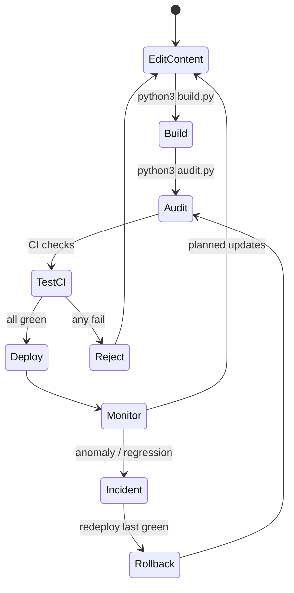

# One-page State Diagram (Operational Lifecycle)

```mermaid
stateDiagram-v2
  [*] --> EditContent
  EditContent --> Build : python3 build.py
  Build --> Audit : python3 audit.py
  Audit --> TestCI : CI checks
  TestCI --> Deploy : all green
  TestCI --> Reject : any fail
  Deploy --> Monitor
  Monitor --> Incident : anomaly / regression
  Incident --> Rollback : redeploy last green
  Rollback --> Audit
  Reject --> EditContent
  Monitor --> EditContent : planned updates
```

## Invariant
No deploy without passing `Build -> Audit -> TestCI` chain.
